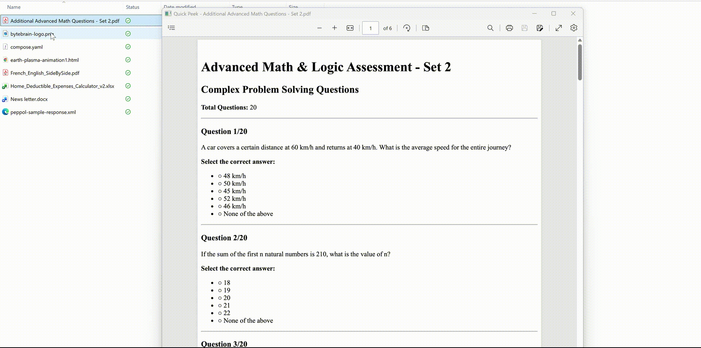

# Quick Peek ⚡

> **Peek into any file, instantly.**  
> The missing "Quick Look" feature for Windows.

**Quick Peek** is a high-performance, lightweight tool that brings macOS-style file previews to Windows 10 and 11. Simply select a file and press **Spacebar** to see what's inside—no need to open heavy applications.

---

## 🚀 Key Features

*   **⚡ Instant Previews**: Press **Space** to peek, **Esc** to close. It's that fast.
*   **📄 Office Documents**: High-fidelity rendering for **Word**, **Excel**, and **PowerPoint** files (uses your installed Office).
*   **🖥️ Windows 11 Ready**: Fully supports the Windows 11 Desktop and modern Explorer styling.
*   **💻 Developer Friendly**:
    *   **Syntax Highlighting** for over 100+ coding languages.
    *   **Markdown** reader mode with GitHub-style formatting.
    *   **JSON** & **XML** pretty printing.
*   **📦 Archives**: Peek into **ZIP** files and **Folders** without extracting them.
*   **🎨 Media**: Native support for Images, Audio, Video, and PDFs.

## 📥 Download

Get the latest version from the **[Releases Page](../../releases)**.

## 🛠️ Usage

1.  **Install** and run Quick Peek (it sits quietly in your system tray).
2.  **Select** any file in File Explorer or on your Desktop.
3.  Press **Space**.
4.  Enjoy!

---

  Built with ❤️ by Bytebrain Technologies

